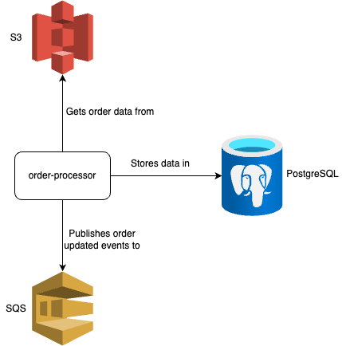

# order-processor

[](https://github.com/kraluk/order-processor/actions/workflows/ci.yaml)

`order-processor` is a service that process orders in the following way:

* reads data from a `*.csv` file provided by an external service in an AWS S3 bucket
* processes it using batching techniques (not loading all data to the memory) and transforms it to orders entities that
  are stored in a PostgreSQL database
* using transaction outbox pattern, sends messages to an AWS SQS queue as order updated events

The application is written in Java 21 using Gradle 8 and Spring Boot 3 with enabled Virtual Threads support. The project
is using jOOQ, liquibase, and Spring Cloud AWS as well.

Some kind of variation of the Clean Architecture has been used in the project to organise the code.

## Architecture diagram



## Requirements

* Java 21 - preferable [Eclipse Temurin](https://adoptium.net/)
* Gradle - or use its wrapper `gradlew`
* container runtime - preferable [Colima](https://github.com/abiosoft/colima)

## Way of working

* run all tests with `./gradlew check`
* run unit tests with `./gradlew test`
* run integration and acceptance tests with `./gradlew integrationTest`
* check dependencies with `./gradlew dependencyUpdates`
* reformat code base `./gradlew spotlessApply`
* generate jOOQ metamodel `./gradlew jooqGenerate`

## Configuration

### Running locally

1. Run `docker compose up` to start all required services
2. Run `./gradlew bootRun --args='--spring.profiles.active=local'` to start the application with the `local` profile

### testcontainers with Colima

To use properly `testcontainers` with Colima, Add following environment variables to your shell profile (e.g.
`~/.bash_profile` or `~/.zprofile`):

```bash
export DOCKER_HOST="unix:///Users/$USER/.colima/default/docker.sock"
export TESTCONTAINERS_DOCKER_SOCKET_OVERRIDE="/var/run/docker.sock"
```

For more details see [docs](https://java.testcontainers.org/supported_docker_environment/)
and [this issue](https://github.com/testcontainers/testcontainers-java/issues/5034)

## Open API docs

The API is documented using OpenAPI and can be accessed under `/api-docs` path.

There is also a Swagger UI available under `/swagger-ui/` path.

For local development they can be accessed via:
* `http://localhost:8080/api-docs/`
* `http://localhost:8080/swagger-ui/`

## Regular process execution

To process orders, a `*.csv` file with the following structure is needed:

```csv
"businessId","value","currency","notes","updatedAt"
"10000000-0000-0000-0000-000000000000","100.00","PLN","note1","2024-01-01T00:00:00.001Z"
```

Such file has to be to uploaded to the proper S3 bucket.

The update process of such a file can be executed by sending a POST request to the
`/v1/orders/updation-executions/{fileName}` endpoint:

```bash
curl -XPOST 'localhost:8080/v1/orders/update-invocations/orders.csv'
```

After the file is processed, the application sends messages to the SQS queue with the order updated events and those
updates can be checked using the `/v1/orders/` endpoint:

```bash
curl -XGET 'localhost:8080/v1/orders?businessId=10000000-0000-0000-0000-000000000000'
```

## What's next

### Issues

1. limit Spring context reloads during integration tests to decrease their execution time
    * consider using 
      [singleton containers](https://java.testcontainers.org/test_framework_integration/manual_lifecycle_control/)
    * potentially [reusable containers](https://java.testcontainers.org/features/reuse/) can be used as well but only
      for the local development
2. add more metrics via Micrometer
3. consider dividing the project into multiple modules (like i.e. `domain`, `contracts`, `application`)
4. ~~introduce better configuration of `hikaricp` to handle PostgreSQL batch queries in a more efficient way~~

### Ideas

1. add registry of processed files
2. consider all `FEATURE` notes from the code
3. ~~add [springdoc](https://springdoc.org/) to provide OpenAPI documentation~~
4. ~~generate [jOOQ's metamodel](https://www.jooq.org/doc/latest/manual/code-generation/codegen-gradle/) of the database~~
